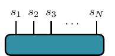
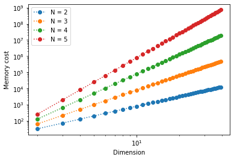
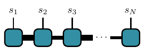
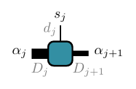
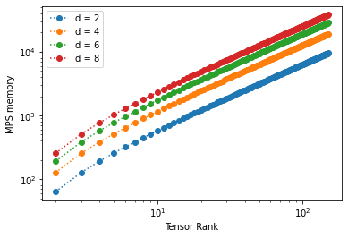
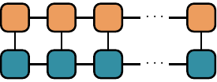
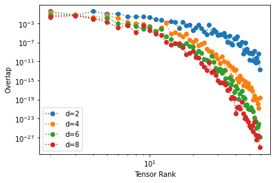

Basic Introduction to Matrix Product States
===========================================

In this tutorial we will give a basic introduction to Matrix Product States (MPS), and show
how to efficiently compute tensor-components of an MPS, and overlaps between two MPS.

We'll be using the following libraries:

.. code-block:: python3

  import tensornetwork as tn
  import numpy as np
  import matplotlib.pyplot as plt

The cost of high-dimensional tensors
------------------------------------

We begin by analyzing the scaling of the memory cost of storing and accessing elements of tensors with increasing rank and dimension.
While the computational complexity of accessing an item in a multidimensional array is :math:`O(1)`,
the main cost is the exponentially growing *memory* required to store the tensor.

Let our tensor be :math:`T^{s_1 \cdots s_{\textsf{N}}}` , where each :math:`s_i \in \{1, \ldots d_i\}` and where :math:`d_i` is called a **physical dimension**
and :math:`N` is **rank** of the tensor.
In condensed matter or quantum computing applications, :math:`N` is usually the system size or number the number of qubits.
The standard graphical representation of this tensor looks like this,

	  
where each line represents one index of the tensor.

Now let's create a tensor with random entries, with ranks and physical dimensions that run over small ranges,
and analyze their memory requirements:

.. code-block:: python3

  def create_tensor(dimension, rank):
    '''Constructs a tensor of a given rank with random integers'''
    dim_list = tuple([dimension for _ in range(rank)])
    return np.random.random_sample(dim_list)

  ranks = range(2,6)
  dimensions = range(2,40)

  for rank in ranks:
    memory = []
    for dim in dimensions:
        tensor = create_tensor(dim, rank)
        component = tuple(np.random.randint(0, dim, rank))
        memory.append(np.sum([x.nbytes for x in tensor]))
        data = tensor[component]
    plt.loglog(dimensions, memory,'o',ls=':', label = f'N = {rank}')

  plt.legend()
  plt.xlabel('Dimension')
  plt.ylabel('Memory cost')
  plt.show()

This produces the following output:

We see that the memory required to store a tensor scales as :math:`\sim d^{\textsf{N}}`.
This is an *exponential* growth, which quickly saturates our computational resources.

Introducing Matrix Product States
----------------------------------

One way to work around this "dimensionality catastrophe" is to focus on a particular kind of tensors:
those that can be written as a **matrix product state** (the word *state* here is related to the quantum state formed from the coefficients of the tensor).
Matrix product states are a special class of tensors that can be written as products over many rank-3 tensors.
Here is a diagram of such an MPS:

Each square here represents a rank-3 tensor (rank-2 for the left and right boundaires)
:math:`A_{\alpha_j\alpha_{j+1}}^{s_j}`:

As before the vertical lines represent the physical indices. The new horizontal lines are called ancillary indices,
with the physical and ancillary indices at each site :math:`j` labelled by :math:`s_j,\alpha_j` respectively.
A connecting line between two tensors (squares) represents a contraction over the common index of the two tensors.
A varying width of the ancillary legs represents the fact that each dimension can be different (their labels are in gray).
With this convention, the MPS diagram above is a rigorous representation of the mathematical expression

.. math::
   
  T^{s_1 \ldots s_\textsf{N}}
  =
  \sum_{\{\alpha\}}
  A^{s_1}_{\alpha_1} A^{s_2}_{\alpha_1 \alpha_2} A^{s_3}_{\alpha_2 \alpha_3}  \cdots A^{s_{N-1}}_{\alpha_{N-2}\alpha_{N-1}} A^{s_N}_{\alpha_{N-1}}

where :math:`\{ \alpha \} = \{ \alpha_1, \ldots, \alpha_{N-1}\}`, and :math:`\alpha_i \in \{1 \cdots D_i \}`.

In this tutorial we will take all :math:`D_i` (also called **bond dimension**) equal to a single :math:`D` . Any tensor can be written as
an MPS by means of the **Singular Value Decomposition** (although at the cost of very high bond dimensions --exponentially high as :math:`N\to \infty`)

We begin by creating directly the node structure of the MPS. First we define functions to build each block of the MPS and then the MPS itself:

.. code-block:: python3

  # Retrieving a component

  def block(*dimensions):
    '''Construct a new matrix for the MPS with random numbers from 0 to 1'''
    size = tuple([x for x in dimensions])
    return np.random.random_sample(size)

  def create_MPS(rank, dimension, bond_dimension):
    '''Build the MPS tensor'''
    mps = [
        tn.Node( block(dim, bond_dim) )] +
        [tn.Node( block(bond_dim, dim, bond_dim)) for _ in range(rank-2)] +
        [tn.Node( block(bond_dim, dim) )
        ]

    #connect edges to build mps
    connected_edges=[]
    conn=mps[0][1]^mps[1][0]
    connected_edges.append(conn)
    for k in range(1,rank-1):
        conn=mps[k][2]^mps[k+1][0]
        connected_edges.append(conn)

    return mps, connected_edges

We will calculate the memory size of MPS of different dimensions and ranks (notice we are able to go much farther than before)

.. code-block:: python3

  dimensions = range(2,9,2)
  MPS_ranks = range(2,150)
  MPS_memory = []

  for dim in dimensions:
      bond_dim = 2
      MPS_memory = []
      for i in range(len(MPS_ranks)):
          rank = MPS_ranks[i]

          # Creating the MPS state:
          ##################################################################
          mps_nodes, mps_edges = create_MPS(rank, dim, bond_dim)
          MPS_memory.append(np.sum([x.tensor.nbytes for x in mps_nodes]))

      # Plot Results
      plt.loglog(MPS_ranks, MPS_memory, 'o',ls=':', label = f'd = {dim}')

  plt.legend()
  plt.xlabel('Tensor Rank')
  plt.ylabel('MPS memory')

  plt.show()

We obtain the following results:

We see that memory requirements drop significantly: the scaling is now :math:`\sim N` (which is polynomial). We can probe higher physical dimensions with less memory.

Retrieving components of a MPS
------------------------------

Let us now retrieve a component of a system of physical dimension :math:`2` and rank :math:`N=20`. This is equivalent to accessing the components of the wavefunction of a 1D quantum chain of :math:`20` qubits! The main computational cost will be the contraction of the MPS bonds. Here we use a simple algorithm to perform the calculation: contract each bond successively until the entire MPS has collapsed to the desired component of the tensor.

With this scheme one can calculate a component of the tensor in a time linear in :math:`N`.

.. code-block:: python3

  ########################################################################
  #----- Retrieving a Component from an MPS by Contracting its edges-----#
  ########################################################################
  dim = 2
  bond_dim = 2
  rank = 20
  components=tuple(np.random.randint(0, dim, rank)) #select randomly the components that we will retrieve
  print(f'components are: {components}')

  mps_nodes, mps_edges = create_MPS(rank, dim, bond_dim)
  for k in range(len(mps_edges)):
      A = tn.contract(mps_edges[k])

  #the last node now has all the edges corresponding to the tensor components.

  print(f'coefficient of the tensor at the selected components: {A.tensor[components]}')

Using the TensorNetwork library
--------------------------------

TensorNetwork offers a simple built-in MPS class which can be used for tensor network calculations, which we will use in the following.
Retrieving a component is again simply done by contracting over ancillary indices of the MPS.
We'll write the entire algorithm for :math:`\textsf{N} = 24` and :math:`d = d_i = 2` (again to make reference to spins):

.. code-block:: python3

  #Component Retrieval Algorithm:

  rank = 24
  phys_dim = 2
  bond_dim = 6

  # build the mps:
  # the state is canonically normalized when we define the class FiniteMPS
  mpstate = tn.FiniteMPS.random(
    d = [phys_dim for _ in range(rank)],
    D = [bond_dim for _ in range(rank-1)],
    dtype = np.float32,
    canonicalize=True
    )

  # connect the edges in the mps and contract over bond dimensions
  nodes = [tn.Node(tensor,f'block_{i}') for i,tensor in enumerate(mpstate.tensors)]

  connected_bonds = [nodes[k].edges[2] ^ nodes[k+1].edges[0] for k in range(-1,rank-1)]

  for x in connected_bonds:
   contracted_node = tn.contract(x) # update for each contracted bond

  # evaluate at a desired component
  component = tuple(np.random.randint(0,phys_dim,rank))

  print(f'Selected components of tensor: {component}')
  print(f'Corresponding coefficient of tensor: {contracted_node.tensor[component]}')

MPS form a special class of 1-dimensional quantum wave functions which are only weakly entangled. In 1 spatial dimension, there is a rigorous proof
that ground states of gapped local Hamiltonians can be approximated to arbitrary accuracy by an MPS with finite bond dimension :math:`D`. Conversely, for any
MPS one can construct a local gapped Hamiltonian which has this MPS as its ground state (called a parent Hamiltonian).

Inner Product of MPS
--------------------

Inner products appear all when calculating expectation values and norms of quantum states.
They are sometimes called *overlaps*. Notice that the MPS structure makes the inner product of tensors graphically intuitive, involving the contraction of all the connected edges and bonds:

An efficient algorithm takes advantage of the factorization properties of the resulting matrices once the tensors have been put into an MPS form. We make the contractions in a "edge-bond-bond" sequence, sweeping along the graph:

.. code-block:: python3

  np.random.seed(3) # fix seed to build the same tensors each time random is called
  
  phys_dim = 2
  bond_dim = 2
  ranks = range(2, 60)
  
  for phys_dim in range(2, 11, 2): # check how physical dim changes scaling
    overlap = []
    for rank in ranks:
        mpstateA = tn.FiniteMPS.random(d = [phys_dim for _ in range(rank)], D = [bond_dim for _ in range(rank-1)], dtype = np.complex128)
        mpstateB = tn.FiniteMPS.random(d = [phys_dim for _ in range(rank)], D = [bond_dim for _ in range(rank-1)], dtype = np.complex128)
        nodesA = [tn.Node(np.conj(tensor), f'A{i}') for i, tensor in enumerate(mpstateA.tensors)]
        nodesB = [tn.Node(tensor, f'B{i}') for i, tensor in enumerate(mpstateB.tensors)]
        nodesA[0][0] ^ nodesB[0][0]
        nodesA[-1][2] ^ nodesB[-1][2]        
        [nodesA[k][2] ^ nodesA[k+1][0] for k in range(rank-1)]
        [nodesB[k][2] ^ nodesB[k+1][0] for k in range(rank-1)]
        [nodesA[k][1] ^ nodesB[k][1] for k in range(rank)]
        contraction = nodesA[0] @ nodesB[0]
        for i in range(1, len(nodesA)):
            contraction = contraction @ nodesA[i] @ nodesB[i]
        overlap.append(np.abs(contraction.tensor))
  
    plt.loglog(ranks,overlap,'o',ls=':')
  plt.show()

Notice how the overlap vanishes as the rank of the tensor grows. 
If we take the inner product of an MPS with itself we obtain the square of the norm, which is :math:`1` for
a normalized state.
