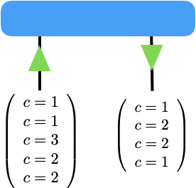

Block sparse tensor networks
============================

Some tensor networks are made of symmetric tensors: tensors that are
left invariant when we act on their indices with transformations that
form a symmetry group. For instance, a tensor can be invariant under the
action of the :math:`Z_2` group (corresponding e.g. to spin flip
symmetry in a system of Ising spins), or of the :math:`U(1)` group
(corresponding e.g. to particle number conservation in a system of
particles), or the :math:`SU(2)` group (corresponding e.g. to spin
isotropy in a system of quantum magnets). The symmetry group can be
Abelian or non-Abelian. In an Abelian group, such as :math:`Z_2` or
:math:`U(1)` all transformations commute, whereas in a non-Abelian
group, such as :math:`SU(2)`, some transformations do not commute.

In a tensor that is symmetric under the action of a group, the symmetry
can be exploited to obtain a more efficient, block-sparse
representation, in which a fraction of the coefficients of the tensor
are zero and do not need to be stored in memory. Moreover, the
manipulation of symmetric tensors, including tensor-tensor
multiplication and tensor decompositions (such as a QR or singular value
decomposition) can be also implemented more efficiently by focusing
directly on the non-vanishing coefficients of the tensor.

In this tutorial we explain our implementation of block sparse tensors
within the TensorNetwork library. Currently, block sparsity support is
restricted to Abelian groups.

If you are in a hurry, here are the most important points of our
block-sparse tensor implementation:

1. support for all abelian symmetries (implementation of new abelian symmetries is very easy)
2. everything is numpy behind the scenes
3. we use a so called **element-wise encoding** strategy to store non-zero tensor elements. This is different
   from other libraries like e.g. ITensor, where non-zero elements are stored in a block-by-block
   fashion in contiguos memory locations (block-wise encoding).
   For tensor networks with high-order tensors (e.g. PEPS or MERA) and many simultaneous symmetries,
   element-wise encoding typically is substantially more efficient than block-wise encoding.
4. we have added a new
   `symmetric` backend to the library that should be used for symmetric
   tensor networks
5. we do currently not support jax, tensorflow or
   pytorch for block-sparse tensor networks

Symmetric tensors
------------------

An in-depth discussion of symmetries in quantum mechanics is way beyond
the scope of this turorial. If you're interested to dive deeper into
this you'll find some references at the end of the notebook. Instead,
we'll give here a minimal introduction to abelian symmetries in tensor
networks, just enough to get you started. We will also only focus on
Abelian symmetries (non-Abelian symmetries are more complicated and
currently not supported). The following figure shows a symmetric tensor
:math:`T_{ij}` of order 2 (i.e. a matrix):

There is quite a bit of information in this picture, and we will cover
it bit by bit. The matrix is represented by the blue rectangle, and its
legs are represented by the two black lines. This is standard notation
so far. For symmetric tensors, each leg needs two additional pieces of
information.

1. The indices of each leg have an **integer charge**
   :math:`c` associated with it. These charges are shown in round brackets
   for each leg. So the index values of the first (left) leg :math:`i` have
   charges :math:`c=\{1,1,3,2,2\}` for the index values
   :math:`i = \{0,1,2,3,4\}`, while the index values of leg :math:`j` have
   charges :math:`c=\{1,2,2,1\}` for :math:`j=\{0,1,2,3\}`

2. Each tensor leg carries an :math:`\color{green}{\textbf{arrow}}` (shown in green)
   indicating if the charges are "inflowing" or "outflowing". In more
   formal lingo, we call a leg with an inflowing arrow a **regular** leg
   and one with an outflowing arrow a **dual** leg. Thus, leg :math:`i` is
   regular while leg :math:`j` is dual.

There are many different types of symmetries, giving rise to different
types of charges. For the sake of simplicity we will only consider so
called :math:`U(1)` symmetries in the following. The corresponding
:math:`U(1)` charges can take values :math:`c \in \mathbb{Z}`. In a
symmetric tensor, only those tensor elements are non-zero for which the
inflowing and outflowing charges are **conserved**. In the above example
these are the elements (0,0), (0,3), (1,0), (1,3), (3,1), (3,2), (4,1),
(4,2). All other elements are identically zero. Our `BlockSparseTensor`
class takes advantage of this by storing only the non-zero elements of
the tensor, together with the charges and arrows. The two main
advantages of this data model are that

1. memory requirements are
   considerably reduced by storing only non-zero elements.
   For tensors with many simultaneous symmetries the memory reduction
   can be a factor of a 100 or more.
2. certain operations, like tensor
   contractions and matrix factorizations, can be substantially sped up (up
   to a factor of 100) by letting them operate on the smaller
   *symmetryblocks* of non-zero elements of the tensor instead of the full
   tensor itself which would include all elements that are identically zero.

Our block-sparse tensor code is organized around the following three
main classes:

`BaseCharge`
------------

We use a `BaseCharge` type to store
charge information, i.e. the integer values of charges, their duality
transformation and their fusion properties. Actual charge types like
e.g. `U1Charge` are derived from the `BaseCharge` type.

`Index`
--------

We use an `Index` type to bundle the charge and flow
information of a tensor leg. The `Index` type is a convenience class.
We use `False` and `True` to encode inflowing and outflowing arrows,
respectively.

`BlockSparseTensor`
-------------------

This type represents a symmetric
tensor. It stores the charge and flow information (together referred to
as meta-data) of the tensor legs, and holds the non-zero elements of the
tensor in a 1d numpy array. Where possible, we have tried to keep the
API of `BlockSparseTensor` identical to numpy's `ndarray`.

To initializate a random `BlockSparseTensor` (the preferred way of
initialization), we need to define the charge and flow information and
pass it to the constructor of `BlockSparseTensor`. Let's initialize a
tensor with the above shown charges:

.. code-block:: python3

    import tensornetwork as tn
    from tensornetwork import BaseCharge, U1Charge, Index, BlockSparseTensor
    import numpy as np

.. code-block:: python3

    c_i = U1Charge([1,1,3,2,2]) #charges on leg i
    c_j = U1Charge([1,2,2,1])   #charges on leg j
    print(c_i)
    print(c_j)
    #use `Index` to bundle flow and charge information
    i = Index(charges=c_i, flow=False) #We use `False` and `True` to represent inflowing and outflowing arrows.
    j = Index(charges=c_j, flow=True)
    tensor = BlockSparseTensor.random([i,j], dtype=np.complex128) #creates a complex valued tensor

.. parsed-literal::

    <class 'tensornetwork.block_sparse.charge.U1Charge'>
    charges: 
    array([[1, 1, 3, 2, 2]], dtype=int16)
    
    <class 'tensornetwork.block_sparse.charge.U1Charge'>
    charges: 
    array([[1, 2, 2, 1]], dtype=int16)
    

The non-zero elements are stored in the attribute
`BlockSparseTensor.data`. We can check that there are indeed only 8
non-zero elements

.. code-block:: python3

    print(tensor.data)

.. parsed-literal::

    [0.84753142+0.22766597j 0.65268088+0.8616853j  0.38187661+0.9934243j
     0.69947644+0.02371861j 0.4538116 +0.84746537j 0.64808382+0.11478288j
     0.65378104+0.44730301j 0.0092896 +0.44352757j]

We can also export `tensor` to a dense `numpy.ndarray` (including
the zero elements) using `todense()`, which reveals the
"block-structure" of the tensor. Be careful though when exporting large
tensors, because this can consume a lot of memory.

.. code-block:: python3

    print(tensor.todense())

.. parsed-literal::

    [[0.84753142+0.22766597j 0.        +0.j         0.        +0.j
      0.65268088+0.8616853j ]
     [0.38187661+0.9934243j  0.        +0.j         0.        +0.j
      0.69947644+0.02371861j]
     [0.        +0.j         0.        +0.j         0.        +0.j
      0.        +0.j        ]
     [0.        +0.j         0.4538116 +0.84746537j 0.64808382+0.11478288j
      0.        +0.j        ]
     [0.        +0.j         0.65378104+0.44730301j 0.0092896 +0.44352757j
      0.        +0.j        ]]

`BlockSparseTensor` can be reshaped just like numpy arrays.

.. code-block:: python3

    i0 = Index(U1Charge.random(19,-3,3), flow=False)
    i1 = Index(U1Charge.random(20,-3,3), flow=False)
    i2 = Index(U1Charge.random(21,-3,3), flow=False)
    a1 = BlockSparseTensor.random([i0,i1,i2], dtype=np.float64)
    #reshaping behaves just as expected, with the exception that the 
    #elementary shape of the tensor has to be respected
    a2 = a1.reshape((19*20, 21))
    print('shape of a2:', a2.shape)
    a3 = a2.reshape((19,20*21))
    print('shape of a3:', a3.shape)
    a4 = a3.reshape((19,20,21))
    print('shape of a4:', a4.shape)

.. parsed-literal::

    shape of a2: (380, 21)
    shape of a3: (19, 420)
    shape of a4: (19, 20, 21)

There are limitations to reshaping. In essence, you can only reshape a
`BlockSparseTensor` into a shape that is consistent with its
"elementary" shape, i.e. the shape at initialization time. This is a
notable difference to numpy arrays. For example, while reshaping of
`a1` into a shape `(19,2,10,21)` would be possible if `a1` was a
dense `numpy.ndarray`, it is no longer possible for
`BlockSparseTensor` because we don't have the neccessary information
to split up `i1` into two seperate legs. If you try anyway, we'll
raise a `ValueError`:

.. code-block:: python3

    a5 = a1.reshape((19,2,10,21))

::

    ---------------------------------------------------------------------------

    ValueError                                Traceback (most recent call last)

    --> 1 a5 = a1.reshape((19,2,10,21))
    tensornetwork/block_sparse/blocksparsetensor.py in reshape(self, shape)
        257       raise ValueError("The shape {} is incompatible with the "
        258                        "elementary shape {} of the tensor.".format(
    --> 259                            tuple(new_shape), tuple(flat_dims)))
        260 
        261     if np.any(new_shape == 0) or np.any(flat_dims == 0):

    ValueError: The shape (19, 2, 10, 21) is incompatible with the elementary shape (19, 20, 21) of the tensor.

Transposing tensors also works as expected:

.. code-block:: python3

    b1 = a1.transpose((0,2,1))
    print('shape of b1', b1.shape)
    b2 = b1.transpose((1,2,0))
    print('shape of b2', b2.shape)

.. parsed-literal::

    shape of b1 (19, 21, 20)
    shape of b2 (21, 20, 19)

`transpose` and `reshape` can be composed arbitrarily:

.. code-block:: python3

    b3 = a1.reshape([19*20,21]).transpose([1,0]).reshape([21,19,20])
    print('shape of b3:', b3.shape)

.. parsed-literal::

    shape of b3: (21, 19, 20)

`transpose` and `reshape` both act only an a tensor's meta-data and are thus essentially
free operations (i.e. no computational cost).

To contract two tensors, their flow and charge information has to match.
A leg with an outflowing arrow can only be contracted with a leg with an
inflowing arrow. In the following snippet, `A.conj()` is the complex
conjugate of tensor `A`. Complex conjugation of a
`BlockSparseTensor` flips the arrows (i.e. reverses the flows) on each
leg.

.. code-block:: python3

    import time
    D0,D1,D2,D3=100,101,102,103
    i0 = Index(U1Charge.random(D0,-5,5), flow=False)
    i1 = Index(U1Charge.random(D1,-5,5), flow=False)
    i2 = Index(U1Charge.random(D2,-5,5), flow=False)
    i3 = Index(U1Charge.random(D3,-5,5), flow=False)
    A1 = BlockSparseTensor.random([i0,i1,i2,i3])
    t1 = time.time()
    A2=tn.block_sparse.tensordot(A1,A1.conj(),([0,1],[0,1])) #conj() returns a copy with flipped flows
    print('sparse contraction time: ', time.time() - t1)
    print('shape of A2:', A2.shape)

.. parsed-literal::

    sparse contraction time:  0.3365299701690674
    shape of A2: (102, 103, 102, 103)

We can compare the runtime of the sparse contraction with the dense one.
On a 2018 macbook pro the sparse contraction is more than 20 times
faster than dense contraction:

.. code-block:: python3

    Adense = np.random.rand(D0,D1,D2,D3)
    t1=time.time()
    A2dense=np.tensordot(Adense,Adense,([0,1],[0,1])) 
    t2=time.time()
    print('dense contraction time:  ', t2-t1)

.. parsed-literal::

    dense contraction time:   7.412016868591309

Some matrix factorizations are also supported. We currently support
`svd`, `eig`, `eigh` and `qr`. If you need more submit an issue
on our github page and we'll try to implement it! Here is an example of
an sv decomposition:

.. code-block:: python3

    A2 = A2.reshape([D2*D3, D2*D3])	  
    U,S,V = tn.block_sparse.svd(A2) #S is a 1d `ChargeArray` object, not a `BlockSparseTensor`.
    check = A2 - U @tn.block_sparse.diag(S) @V #this should be all 0
    print('||A2 - U @ diag(S) @ V||: ',np.linalg.norm(check.todense()))

A remark is in order here. While `U` and `V` above are regular
`BlockSparseTensor` objects, `S` is of a different type
`ChargeArray` that holds the singular values of `A2` in a 1d
array-like object. `ChargeArray` is a base class of
`BlockSparseTensor`. The function `tn.block_sparse.diag()` takes
either a 1d `ChargeArray` and constructs a 2d `BlockSparseTensor`,
or it takes a 2d `BlockSparseTensor` and extracts its diagonal into a
1d `ChargeArray`. `tensordot` contractions (and almost all other
routines) should only be used on `BlockSparseTensor` (unless
explicitly stated otherwise).

Here are the other available matrix factorizations:

.. code-block:: python3

    eta, U = tn.block_sparse.eig(A2) #eta is a 1d `ChargeArray` object, not a `BlockSparseTensor`.
    check = A2 - U @tn.block_sparse.diag(eta) @ tn.block_sparse.inv(U) 
    print('||A2 - U @ diag(eta) @ inv(U)||: ',np.linalg.norm(check.todense()))#this should be close to 0
    
    Q,R = tn.block_sparse.qr(A2) #QR decomposition
    check = A2 - Q@R #this should be all 0
    print('||A2 - Q @ R||: ',np.linalg.norm(check.todense()))
    
    #eigh decomposition
    tmp = BlockSparseTensor.random([i1,i1.copy().flip_flow()])
    herm = tmp + tmp.conj().T #create a hermitian matrix
    
    eta, U = tn.block_sparse.eigh(herm) #eta is a 1d `ChargeArray` object, not a `BlockSparseTensor`.
    check =herm - U @tn.block_sparse.diag(eta) @ U.conj().T
    print('||A2 - U @ diag(eta) @ herm(U)||: ',np.linalg.norm(check.todense()))#this should be close to 0

.. parsed-literal::

    ||A2 - U @ diag(eta) @ inv(U)||:  1.7393301276315685e-07
    ||A2 - Q @ R||:  2.7049451996920878e-09
    ||A2 - U @ diag(eta) @ herm(U)||:  0.0

As you probably noticed, `BlockSparseTensor` can be added and
subtracted, given that their meta-data is matching:

.. code-block:: python3

    i0 = Index(U1Charge.random(10,-3,3), flow=False)
    i1 = Index(U1Charge.random(11,-3,3), flow=False)
    i2 = Index(U1Charge.random(12,-3,3), flow=False)
    B1 = BlockSparseTensor.random([i0,i1,i2])
    B2 = B1 + B1 #matching meta-data

A `ValueError` will be raised if the meta-data is not matching

.. code-block:: python3

    B3 = B2 + B1.transpose((0,2,1)) #raises an error

::

    ---------------------------------------------------------------------------

    ValueError                                Traceback (most recent call last)

    --> 1 B3 = B2 + B1.transpose((0,2,1)) #raises an error
    

    tensornetwork/block_sparse/blocksparsetensor.py in __add__(self, other)
        596 
        597   def __add__(self, other: "BlockSparseTensor") -> "BlockSparseTensor":
    --> 598     self._sub_add_protection(other)
        599     #bring self into the same storage layout as other
        600     _, index_other = np.unique(other.flat_order, return_index=True)

    tensornetwork/block_sparse/blocksparsetensor.py in _sub_add_protection(self, other)
        570       raise ValueError(
        571           "cannot add or subtract tensors with shapes {} and {}".format(
    --> 572               self.shape, other.shape))
        573     if len(self._charges) != len(other._charges):
        574       raise ValueError(

    ValueError: cannot add or subtract tensors with shapes (10, 11, 12) and (10, 12, 11)

Doing things like `B1 += 1` is currently not supported since this
would violate the charge conservation.

`BlockSparseTensor.sparse_shape` returns a `list[Index]` that can be
used to initialize a new `BlockSparseTensor`. Note that the flows of
the legs of the new tensor will be identical to the flows of the
original tensor on the respective legs.

.. code-block:: python3
	  
    D0,D1,D2,D3=100,101,102,103
    i0 = Index(U1Charge.random(D0,-5,5), flow=False)
    i1 = Index(U1Charge.random(D1,-5,5), flow=False)
    i2 = Index(U1Charge.random(D2,-5,5), flow=False)
    i3 = Index(U1Charge.random(D3,-5,5), flow=False)
    A = BlockSparseTensor.random([i0,i1,i2,i3])
    B = BlockSparseTensor.random([A.sparse_shape[0], A.sparse_shape[1]])
    print('shape of B: ', B.shape)

.. parsed-literal::

    shape of B:  (100, 101)

`Index` objects can also be multiplied, which allows to do the following:

.. code-block:: python3

    C = BlockSparseTensor.random([A.sparse_shape[1]*A.sparse_shape[2], A.sparse_shape[0]])
    print('shape of C: ', C.shape)

.. parsed-literal::

    shape of C:  (10302, 100)

You can flip flows of an `Index` in place using `Index.flip_flow()`.
To obtain a copy of the index with flipped flow, use
`Index.copy().flip_flow()`:

.. code-block:: python3
	  
    sparse_shape = A.sparse_shape
    print('flows of indices of A:', [i.flow for i in sparse_shape])
    flipped = [i.copy().flip_flow() for i in sparse_shape]
    print('flows of copied indices of A:', [i.flow for i in flipped])	  

.. parsed-literal::
   
    flows of indices of A: [[False], [False], [False], [False]]
    flows of copied indices of A: [[True], [True], [True], [True]]

The `symmetric` backend in TensorNetwork
------------------------------------------

We have added a `symmetric` backend to TensorNetworks which can be
used to construct symmetric tensor networks.

.. code-block:: python3

    tn.set_default_backend('symmetric')
    
    i0 = Index(U1Charge.random(1000,-3,3), flow=False)
    i1 = Index(U1Charge.random(100,-3,3), flow=False)
    i2 = Index(U1Charge.random(1001,-3,3), flow=False)
    A1 = BlockSparseTensor.random([i0,i1,i2])
    
    #tensordot-style contraction
    A2=tn.block_sparse.tensordot(A1,A1.conj(),([0,1],[0,1])) 

    #ncon style contraction on tensors
    A3 = tn.ncon([A1, A1.conj()],[[1,2,-1],[1,2,-2]])

    #ncon style contraction on nodes
    node = tn.Node(A1)
    node2 = tn.ncon([node, tn.conj(node)],[[1,2,-1],[1,2,-2]])

    
    print('shape of node2: ',node2.shape)
    print('||A3 - A2||: ', np.linalg.norm((A3 - A2).todense())) #should be close to 0
    print('||node2.tensor - A2||: ', np.linalg.norm((node2.tensor - A2).todense())) #should be close to 0

.. parsed-literal::

    shape of node2:  (1001, 1001)
    ||A3 - A2||:  0.0
    ||node2.tensor - A2||:  0.0

The usual TensorNetwork API is also available:

.. code-block:: python3

    n1 = tn.Node(A1)
    n2 = tn.Node(A1.conj())
    n1[0] ^ n2[0]
    n1[1] ^ n2[1]
    result = n1 @ n2
    print(np.linalg.norm((node2.tensor - result.tensor).todense()))

.. parsed-literal::

    0.0

For example, splitting nodes is carried out in the exact same way as for
dense (non-symmetric) tensors.

.. code-block:: python3

    #split node into two nodes
    U1, U2,_ = tn.split_node(n1,[n1[0], n1[1]], [n1[2]])
    print(np.linalg.norm((U1 @ U2).tensor.todense() - n1.tensor.todense()))

.. parsed-literal::

    7.057099298396375e-12

.. code-block:: python3

    #split node using svd
    U1, S,U2,_ = tn.split_node_full_svd(n1,[n1[0], n1[1]], [n1[2]])
    print(np.linalg.norm((U1 @S@ U2).tensor.todense() - n1.tensor.todense()))

.. parsed-literal::

    7.048166180740012e-12

Implementing your own symmetry
------------------------------

In order to implement your own symmetry you need to define a new class
of charges. To illustrate the concept we'll show how to implement a new
class `Z3Charge` (even though it's already supported in the library).
You can find more example code in tensornetwork/block\_sparse/charge.py.
Any custom charge type needs to implement the three static methods
`fuse`, `dual_charges` and `identity_charge`.

* `fuse(charge1, charge2`:
  provides the implementation of charge fusion

* `dual_charges(charge)`:
  provides the implementation of duality transformation of charges

* `identity_charge`: returns the identity charge for the charge type

We don't have to implement `Z3Charge.__init__`, even though in general
it's encouraged to do it in order to perform checks. If you provide it,
be sure to maintain the same function signature (including default
values) as in `BaseCharge`. `super().__init__(...)` should always be
called as shown below.

.. code-block:: python3

    class Z3Charge(BaseCharge):
        """
        We represent Z3 charges as integer values from the set {-1,0,1}
        
        Charge fusion is:
        -1 + -1 ->  1
         1 +  1 -> -1
        -1 +  1 ->  0
         1 + -1 ->  0
         1 +  0 ->  1
        -1 +  0 -> -1     
         0 + -1 -> -1         
         0 +  1 ->  1              
         0 +  0 ->  0
         
        Charge duality is:
        -1 ->  1
         0 ->  0
         1 -> -1
          
        Identity charge is 0
        """
        def __init__(self,
                     charges,
                     charge_labels = None,
                     charge_types = None,
                     charge_dtype=np.int16) -> None:
            """
            perform checks here
            """
            super().__init__(
                charges,
                charge_labels,
                charge_types=[type(self)],
                charge_dtype=charge_dtype)
    
        @staticmethod
        def fuse(charge1, charge2):
            return np.mod(np.ravel(np.add.outer(charge1 ,charge2))+1,3) - 1
        @staticmethod
        def dual_charges(charge):
            return -charge #for this representation, duality is negation of the sign
        @staticmethod
        def identity_charge():
            return np.int16(0) #the identity charge for our representation if `0`
        @classmethod
        def random(cls, dimension, minval=-1, maxval=1):
            """
            convenience function for initialization of random charge
            """
            if minval < -1 or minval > 1:
                raise ValueError("minval has to be between -1 and 1")
            if maxval < -1 or maxval > 1:
                raise ValueError("minval has to be between -1 and 1")
                
            charges = np.random.randint(minval, maxval + 1, dimension, dtype=np.int16)
            return cls(charges=charges)

That's it, we're ready to use the symmetry.

.. code-block:: python3

    tn.set_default_backend('symmetric')
    i0 = Index(Z3Charge.random(100,-1,1), True)
    i1 = Index(Z3Charge.random(100,-1,1), False)
    i2 = Index(Z3Charge.random(100,-1,1), True)
    
    D = BlockSparseTensor.random([i0,i1,i2])
    result = tn.ncon([D, D.conj()], [[1,2,-1],[1,2,-2]])

References
----------

-  Howard Georgi, Lie Algebras in Particle Physics, Frontiers in Physics
-  https://arxiv.org/abs/1008.4774
-  https://arxiv.org/abs/1208.3919
-  https://arxiv.org/abs/1202.5664
