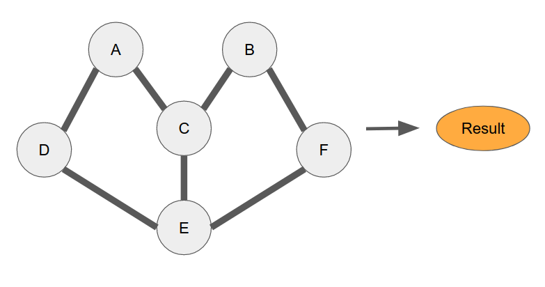
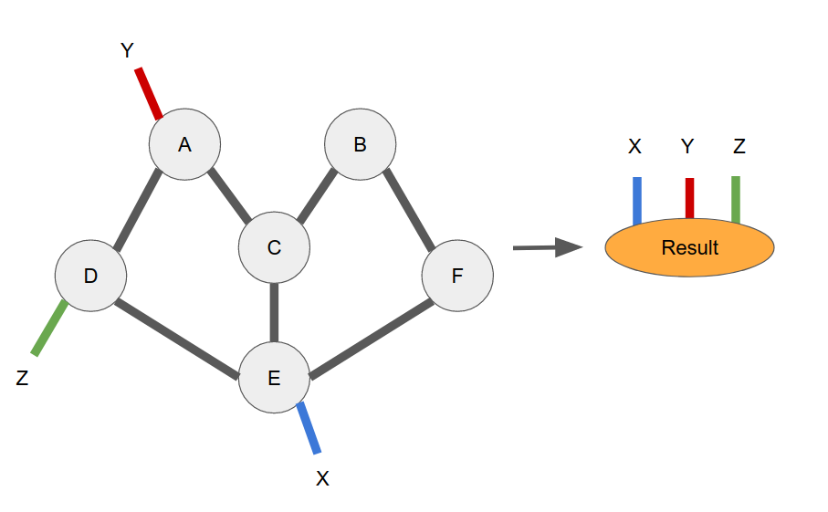
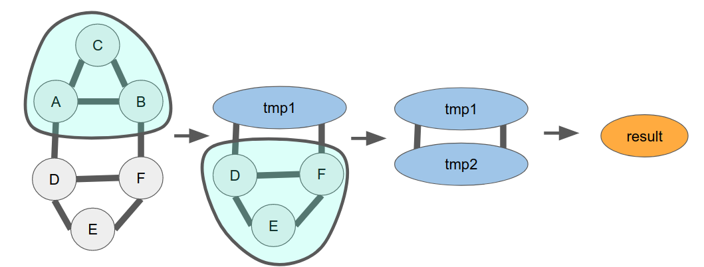
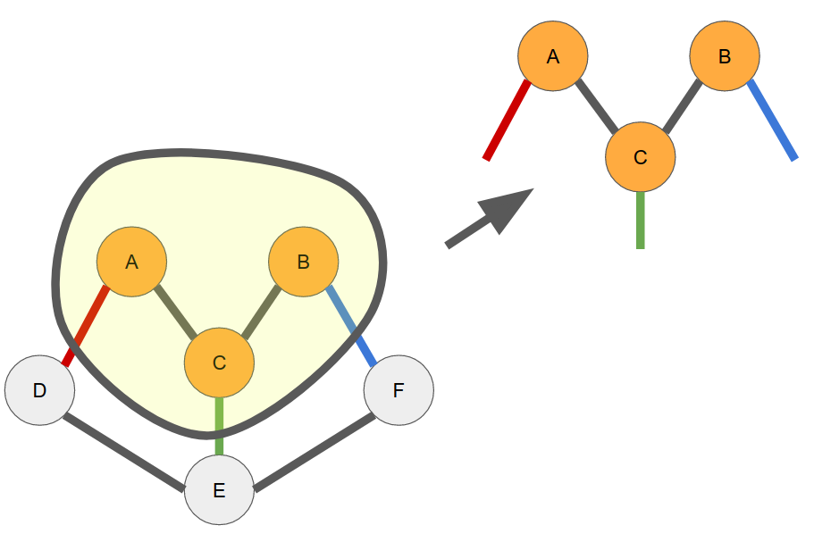

Copying and Contracting
========================

Automated contraction
---------------------
Finding good contracting paths for arbitrary tensor networks can be challenging. In fact, finding the optimal contration path is proven to be NP-Hard. While we can't crack NP hard problems, we can get decent results for small sized systems.

Using a contraction algorithm is very easy.

.. code-block:: python3

  result = tn.contractors.auto([a, b, c, d, e, f])

We have several contraction algorithms avaliable as of April 2020.

- `optimal`: Find the true optimal path via brute force. It can be extremly slow for more than ~10 nodes.
- `greedy`: Continuously do the cheapest contraction possible. Works well as a default for networks with many nodes.
- `branch`: Brute search, but only check the top `n` possiblities per step.
- `auto`: Automatically decide which of the above 3 algorithms to use.

When contracting a network with more than one dangling leg, you must specify the output order of the dangling legs. 

.. code-block:: python3

  result = tn.contractors.auto(
      [a, b, c, d, e, f]
      output_edge_order=[x, y, z]
  )

If you do not care about the final output order (for instance, if you are only doing a partial network contraction and the intermidiate order doesn't matter), then you can set `ignore_edge_order=True` and you won't need to supply an `output_edge_order`.

Contracting subgraph
---------------------
There are many instances when you want to contract only a subset of your network. Perhaps you know good intermidiate states, but not how to get there efficiently. You can still very easily get a good contraction order by using the subnetwork contraction feature of the `contractors`.

 .. code-block:: python3

  # Say all of these nodes are connected somehow.
  a, b, c, d, e, f = build_your_network(...)
  tmp1  = tn.contractors.optimal([a, b, c], ignore_edge_order=True)
  tmp2 = tn.contractors.optimal([d, e, f], ignore_edge_order=True)
  result = tmp1 @ tmp2

Reusing networks
------------------
When building tensor networks, it's very common to want to use a single tensornetwork for many purposes. For example, a user may want to use an MPS to calculate an inner product with some product state as well as its partition function. `Nodes` within `tensornetwork` are mutable, so to presever the original MPS connectivity, you'd need to copy the nodes before contraction.

 .. code-block:: python3

  # Calcualte the inner product of two MPS/Product state networks.
  def inner_product(x: List[tn.Node], y: List[tn.Node]) -> tn.Node:
    for a, b in zip(x, y)
      # Assume all of the dangling edges are mapped to the name "dangling"
      tn.connect(a["dangling"], b["dangling"])
    return tn.contractors.greedy(x + y)

  # Build your original MPS
  mps_nodes = build_your_mps(...)

  # Calculate the inner product with a product_state
  product_state_nodes = build_your_product_state(...)
  mps_copy = tn.replicate_nodes(mps_nodes)
  result1 = inner_product(mps_copy, product_state_nodes)

  # Calculate the partition function.
  mps_copy = tn.replicate_nodes(mps_nodes)
  mps_conj_copy = tn.replicate_nodes(mps_nodes, conjugate=True)
  result2 = inner_product(mps_copy, mps_conj_copy)

If you need more advance access to your copied network, `tn.copy` will return two dictionaries mapping your original nodes and edges to the newly copied versions.

Copying subnetwork
------------------

When copying a subgraph of a network, all of the connections between nodes are preserved in the copied network. Any standarded edges between two nodes where one is copied and isn't, that edge becomes a dangling edge on the same axis of the copied node.

 .. code-block:: python3

  # Say all of these nodes are connected somehow.
  a, b, c, d, e, f = build_your_network(...)
  new_a, new_b, new_c = tn.replicate_nodes([a, b, c])

