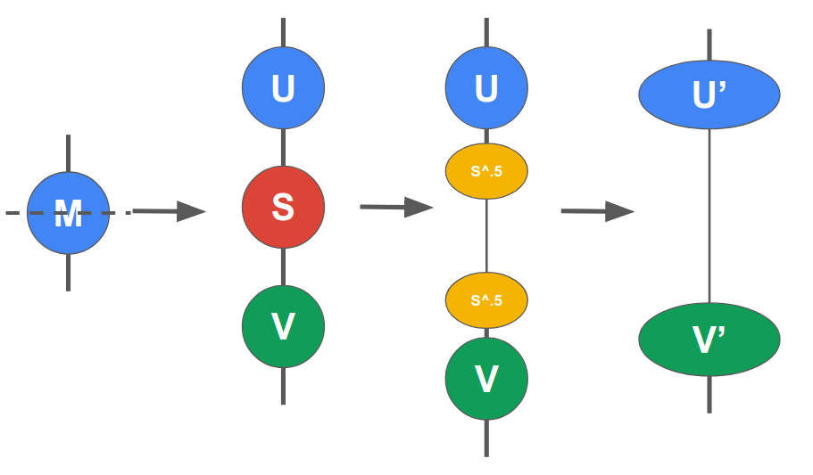

Tensor Decompositions and Node Spliting
=======================================

Singular Value Decomposition (SVD)
----------------------------------
While SVD is really cool, describing SVD is out of scope of this tutorial. Instead, we will describe how SVD is used in TensorNetwork.

SVD and other decompositions like QR are used to "split a node". That is, it takes a single node (of arbitrary order!) and splits it into several new nodes. The main method for this is `tn.split_node`

.. code-block:: python3

  u_prime, vh_prime, _ = tn.split_node(m, left_edges=[m[0]], right_edges=[m[1]])

Split node works by taking the SVD of the matrix :math:`M` and then spliting the :math:`S` node
via a single square root operation. The two :math:`\sqrt{S}` nodes are then merged into :math:`U` and :math:`V*` respectively. The final two nodes are returned. The last axis of `u` and the first axis of `v` are connected together.

Compression
-----------
One of the main advantages of using SVD is it allows you to have a 
very nice mathematical way of compressing tensors. That is, your can preseve the maximum L2 norm
by dropping the lower singular values during compression. You can achieve this with either the `max_singluar_values` or `max_truncation_error` attributes. 

.. code-block:: python3

  u_prime, vh_prime, truncation_error = tn.split_node(..., max_singular_values=10)
  # Truncation error is a tensor (not a Node!) of the dropped singular values.
  print(truncation_error) # Example: array([2.7, 1.31, 0.13, ...])

Similar methods include:

- `split_node_full_svd`
- `split_node_qr`
- `split_node_rq`