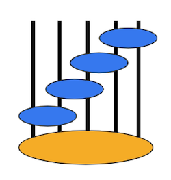

# TensorNetwork Keras Layers

TN Keras exists to simplify tensorization of existing TensorFlow models. These layers try to match the APIs for existing Keras layers closely. Please note these layers are currently intended for experimentation only, not production. These layers are in alpha and upcoming releases might include breaking changes.

## Table of Contents

- [Usage](#usage)
- [Networks](#networks)
- [Support](#support)

## Usage

`pip install tensornetwork` and then:

```python
import tensornetwork as tn
import tensorflow as tf
from tensorflow.keras.models import Sequential
from tensorflow.keras.layers import Dense

# Import tensornetwork keras layer
from tensornetwork.tn_keras.layers import DenseMPO

# Build a fully connected network using TN layer DenseMPO
mpo_model = Sequential()
mpo_model.add(DenseMPO(256, num_nodes=4, bond_dim=8, use_bias=True, activation='relu', input_shape=(1296,)))
mpo_model.add(DenseMPO(81, num_nodes=4, bond_dim=4, use_bias=True, activation='relu'))
mpo_model.add(Dense(1, use_bias=True, activation='sigmoid'))

...
```
## Networks

- **DenseDecomp**. A TN layer comparable to Dense that carries out matrix multiplication with 2 significantly smaller weight matrices instead of 1 large one. This layer is similar to performing a SVD on the weight matrix and dropping the lowest singular values. The TN looks like:


- **DenseMPO**. A TN layer that implements an MPO (Matrix Product Operator), a common tensor network found in condensed matter physics. MPOs are one of the most successful TNs we've seen in practice. Note for this layer the input dimension, output dimension, and number of nodes must all relate in order for the network structure to work. Specifically, `input_shape[-1]**(1. / num_nodes)` and `output_dim**(1. / num_nodes)` must both be round. The TN looks like:


- **Conv2DMPO**. A TN layer that recreates the functionality of a traditional 2d convolutional layer, but stores the 'kernel' as a network of nodes forming an MPO. The bond dimension of the MPO can be adjusted to increase or decrease the number of parameters independently of the input and output dimensions. When the layer is called, the MPO is contracted into a traditional kernel and convolved with the layer input to produce a tensor of outputs. As with the DenseMPO the `input_shape[-1]**(1. / num_nodes)` and `output_dim**(1. / num_nodes)` must both be round.

- **Entangler**. A TN layer inspired by quantum circuits that allows one to dramatically increase the dimensionality of hidden layers, far beyond what is currently feasible with normal dense layers e.g. hidden layers of >1M in size. Note for this layer the input dimensions and output dimensions will be equal. Additionally, `input_shape[-1]**(1. / num_legs)` must be round. `num_levels` is the only parameter that does not change input/output shape; it can be increased to increase the power of the layer, but inference time will also scale approximately linearly. The TN looks like:



- **Expander**. A TN layer to expand the dimensionality of an input tensor, commonly used in conjunction with Entangler. Since Entangler does not modify the input dimension, an Expander layer is often placed before an Entangler layer to increase the size of the input. Note the output dim will be `input_shape[-1] * (exp_base**num_nodes)` so increasing `num_nodes` will increase the output dim exponentially. The TN looks like: 


- **Condenser**. A TN layer to reduce the dimensionality of an input tensor, commonly used in conjunction with Entangler. Since Entangler does not modify the output dimension, a Condenser layer is often placed after an Entangler layer to decrease the size of the output. Note the output dim will be `input_shape[-1] // (exp_base**num_nodes)` so increasing `num_nodes` will decrease the output dim exponentially. The TN looks like:


## Support

Please [open an issue](https://github.com/google/TensorNetwork/issues/new) for support.
